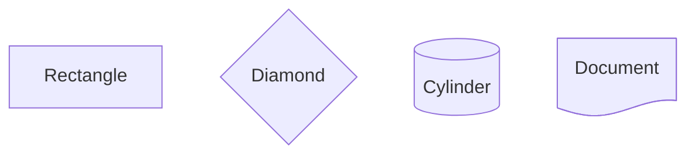
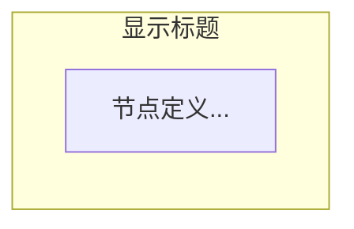
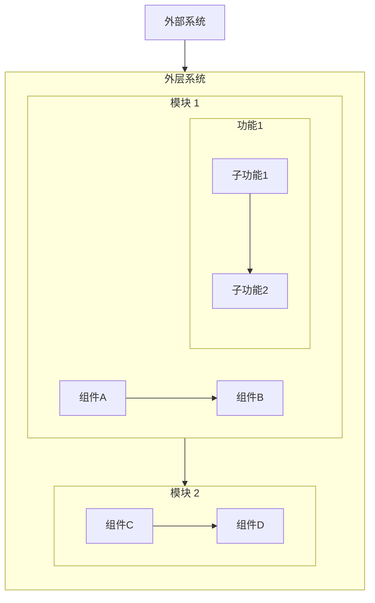
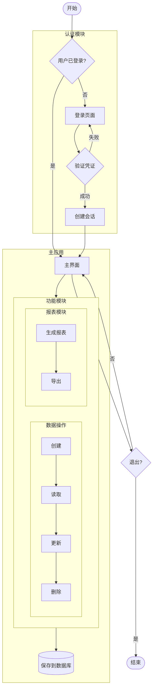

# Mermaid Flowchart 研究报告

## 目录
1. [Mermaid Flowchart 语法详解](#1-mermaid-flowchart-语法详解)
2. [Mermaid 解析方案](#2-mermaid-解析方案)
3. [提取关键信息的技术方案](#3-提取关键信息的技术方案)
4. [推荐的技术方案](#4-推荐的技术方案)

---

## 1. Mermaid Flowchart 语法详解

### 1.1 节点定义语法

Mermaid 支持 13 种基础节点形状和 30+ 种扩展形状（v11.3.0+）：

#### 基础节点形状

| 形状名称 | 语法 | 示例 | 用途 |
|---------|------|------|------|
| **矩形** | `id[Text]` | `A[Process]` | 标准流程步骤 |
| **圆角矩形** | `id(Text)` | `B(Start)` | 开始/结束点 |
| **体育场型** | `id([Text])` | `C([Action])` | 动作步骤 |
| **子程序** | `id[[Text]]` | `D[[Subroutine]]` | 子流程 |
| **数据库** | `id[(Text)]` | `E[(Database)]` | 数据存储 |
| **圆形** | `id((Text))` | `F((Event))` | 事件节点 |
| **不对称** | `id>Text]` | `G>Output]` | 输出 |
| **菱形** | `id{Text}` | `H{Decision?}` | 决策点 |
| **六边形** | `id{{Text}}` | `I{{Prepare}}` | 准备步骤 |
| **平行四边形** | `id[/Text/]` | `J[/Input/]` | 输入 |
| **反向平行四边形** | `id[\Text\]` | `K[\Output\]` | 输出 |
| **梯形** | `id[/Text\]` | `L[/Manual\]` | 手动操作 |
| **反向梯形** | `id[\Text/]` | `M[\Loop/]` | 循环 |
| **双圆** | `id(((Text)))` | `N(((Stop)))` | 终止点 |

#### 新语法格式 (v11.3.0+)



#### 扩展形状类型

- `rect` - 矩形
- `diam` - 菱形
- `cyl` - 圆柱体
- `doc` - 文档
- `cloud` - 云形
- `trap` - 梯形
- `trap-b` - 反向梯形
- 以及其他 20+ 种专业形状

### 1.2 边（连接线）的定义语法

#### 基本连接类型

| 连接类型 | 语法 | 示例 | 说明 |
|---------|------|------|------|
| **实线箭头** | `-->` | `A --> B` | 标准流向 |
| **开放链接** | `---` | `A --- B` | 无方向连接 |
| **虚线箭头** | `-.->` | `A -.-> B` | 虚线流向 |
| **粗线箭头** | `==>` | `A ==> B` | 强调流向 |
| **带文本箭头** | `-- text -->` 或 `-->|text|` | `A -->|Yes| B` | 标注条件 |
| **圆形端点** | `--o` 或 `o--` | `A o--o B` | 关联关系 |
| **叉形端点** | `--x` 或 `x--` | `A x--x B` | 排除关系 |

#### 箭头长度控制

通过增加连接符数量来控制边的长度：

```mermaid
flowchart TD
    A --> B      %% 标准长度
    C ----> D    %% 较长
    E ------> F  %% 更长
    G =====> H   %% 粗线长
```

#### 边的 ID 标识 (新特性)

可以为边分配 ID：

```mermaid
flowchart TD
    A --> B
    edge1@A --> C  %% 为边分配 ID
```

### 1.3 子图（Subgraph）语法

#### 基本子图语法



#### 子图方向控制

- `direction TD` - 从上到下（Top Down）
- `direction LR` - 从左到右（Left Right）
- `direction BT` - 从下到上（Bottom Top）
- `direction RL` - 从右到左（Right Left）

#### 嵌套子图示例



#### 子图嵌套注意事项

1. **渲染器选择**：深层嵌套（3层以上）建议使用 `elk` 渲染器
   ```mermaid
   %%{init: {"flowchart": {"defaultRenderer": "elk"}} }%%
   flowchart TB
       subgraph A
           subgraph B
               subgraph C
                   node1 --> node2
               end
           end
       end
   ```

2. **子图连接**：可以直接连接子图
   ```mermaid
   flowchart LR
       subgraph1 --> subgraph2
       外部节点 --> subgraph1
   ```

### 1.4 节点 ID 命名规则

#### 允许的字符

- 字母（a-z, A-Z）
- 数字（0-9）
- 下划线（_）
- 连字符（-）

#### 命名限制

1. **禁止使用小写 "end"**：会与子图结束关键字冲突
   ```mermaid
   %% 错误
   end[结束]

   %% 正确
   End[结束]
   endNode[结束]
   ```

2. **避免以小写 "o" 或 "x" 开头**：可能与边的端点符号冲突
   ```mermaid
   %% 有风险
   o1[节点]
   x2[节点]

   %% 推荐
   O1[节点]
   node_o1[节点]
   ```

3. **ID 与显示文本分离**：ID 用于引用，文本用于显示
   ```mermaid
   flowchart TD
       complexId[这是显示的中文文本]
       node_123[Node Display Text]
   ```

---

## 2. Mermaid 解析方案

### 2.1 官方解析包

#### @mermaid-js/parser

**安装：**
```bash
npm install @mermaid-js/parser
```

**特点：**
- Mermaid 官方提供的独立解析器包
- 使用 Lexer + Parser 架构
- 将 Mermaid 文本转换为 Token 流，再解析为 AST
- 当前版本：0.6.2

**使用方式：**
```javascript
import { parse } from '@mermaid-js/parser';

const mermaidText = `
flowchart TD
    A[Start] --> B{Decision}
    B -->|Yes| C[Process]
    B -->|No| D[End]
`;

try {
    const ast = parse(mermaidText);
    console.log(ast);
} catch (error) {
    console.error('解析错误:', error);
}
```

### 2.2 Mermaid.js 主包内置解析

#### mermaid npm 包

**安装：**
```bash
npm install mermaid
```

#### 方法一：使用 getDiagramFromText (非官方 API)

```javascript
import mermaid from 'mermaid';

// 初始化 mermaid
mermaid.initialize({ startOnLoad: false });

const mermaidText = `
flowchart TD
    A[Start] --> B[End]
`;

async function parseDiagram() {
    // 必须先调用 parse
    await mermaid.parse(mermaidText);

    // 获取图表对象（已废弃但仍可用）
    const diagram = await mermaid.mermaidAPI.getDiagramFromText(mermaidText);

    // 访问解析器
    const parser = diagram.parser;

    // 获取节点、边、子图
    const vertices = parser.yy.getVertices();
    const edges = parser.yy.getEdges();
    const subgraphs = parser.yy.getSubgraphs();

    console.log('节点:', vertices);
    console.log('边:', edges);
    console.log('子图:', subgraphs);
}

parseDiagram();
```

#### 方法二：直接访问 parser.yy API

```javascript
import mermaid from 'mermaid';

const diagramDefinition = `
flowchart TD
    subgraph cluster1
        A[Node A] --> B[Node B]
    end
    B --> C[Node C]
`;

async function extractElements() {
    await mermaid.parse(diagramDefinition);
    const diagram = await mermaid.mermaidAPI.getDiagramFromText(diagramDefinition);

    // 从 parser.yy 获取数据
    const vertices = diagram.parser.yy.getVertices();
    const edges = diagram.parser.yy.getEdges();
    const subgraphs = diagram.parser.yy.getSubgraphs();

    return { vertices, edges, subgraphs };
}
```

**返回数据结构：**

```javascript
// vertices 示例
{
    "A": {
        "id": "A",
        "text": "Node A",
        "labelType": "text",
        "styles": [],
        "classes": [],
        "domId": "flowchart-A-1234"
    },
    "B": {
        "id": "B",
        "text": "Node B",
        "labelType": "text",
        "styles": [],
        "classes": []
    }
}

// edges 示例
[
    {
        "start": "A",
        "end": "B",
        "type": "arrow_point",
        "text": "",
        "labelType": "text",
        "stroke": "normal",
        "length": 1
    }
]

// subgraphs 示例
[
    {
        "id": "cluster1",
        "title": "cluster1",
        "nodes": ["A", "B"],
        "classes": [],
        "dir": "TB"
    }
]
```

### 2.3 第三方解析库

#### @rendermaid/core

**安装：**
```bash
npm install @rendermaid/core
```

**特点：**
- 高性能 TypeScript 库
- 函数式编程风格
- 提供完整的 AST 结构
- 支持多种图表类型

**使用示例：**
```typescript
import { parseMermaid, renderSvg } from "@rendermaid/core";

const diagram = `
flowchart TD
    A[Start] --> B{Decision}
    B -->|Yes| C[Process A]
    B -->|No| D[Process B]
    C --> E[End]
    D --> E
`;

const parseResult = parseMermaid(diagram);

if (parseResult.success) {
    const ast = parseResult.data;

    console.log('图表类型:', ast.diagramType);
    console.log('节点:', ast.nodes);
    console.log('边:', ast.edges);
    console.log('元数据:', ast.metadata);

    // 可选：渲染为 SVG
    const svgResult = renderSvg(ast);
    if (svgResult.success) {
        console.log('SVG:', svgResult.data);
    }
} else {
    console.error('解析失败:', parseResult.error);
}
```

**AST 类型定义：**
```typescript
type MermaidAST = {
    readonly diagramType: DiagramType;
    readonly nodes: ReadonlyMap<string, MermaidNode>;
    readonly edges: readonly MermaidEdge[];
    readonly metadata: ReadonlyMap<string, unknown>;
};

type MermaidNode = {
    readonly id: string;
    readonly text: string;
    readonly shape: NodeShape;
    readonly styles?: readonly Style[];
    readonly classes?: readonly string[];
};

type MermaidEdge = {
    readonly from: string;
    readonly to: string;
    readonly type: EdgeType;
    readonly text?: string;
    readonly stroke?: StrokeType;
};
```

#### @lifeomic/mermaid-simple-flowchart-parser

**安装：**
```bash
npm install @lifeomic/mermaid-simple-flowchart-parser
```

**特点：**
- 轻量级解析器
- 专注于简单的 flowchart 解析
- 返回简化的 JSON 结构

### 2.4 Excalidraw 的解析方案

Excalidraw 采用混合方案，结合 Mermaid 解析和 SVG 分析：

```javascript
// Excalidraw 的解析流程
async function parseFlowchart(definition) {
    // 1. 使用 Mermaid 获取基础数据
    const diagram = await mermaid.mermaidAPI.getDiagramFromText(definition);
    const parser = diagram.parser.yy;

    // 2. 获取抽象数据
    const rawVertices = parser.getVertices();
    const rawEdges = parser.getEdges();
    const rawSubgraphs = parser.getSubgraphs();

    // 3. 渲染 SVG 以获取布局信息
    const svgElement = await mermaid.render('temp-id', definition);

    // 4. 从 SVG 中提取位置和尺寸
    const vertices = parseVerticesFromSVG(svgElement, rawVertices);
    const edges = parseEdgesFromSVG(svgElement, rawEdges);
    const subgraphs = parseSubgraphsFromSVG(svgElement, rawSubgraphs);

    return { vertices, edges, subgraphs };
}

function parseVerticesFromSVG(svg, rawVertices) {
    // 从 SVG 中提取 x, y, width, height
    const vertices = [];
    for (const [id, vertex] of Object.entries(rawVertices)) {
        const svgNode = svg.querySelector(`[id*="${id}"]`);
        const bbox = svgNode.getBBox();

        vertices.push({
            id: vertex.id,
            text: vertex.text,
            x: bbox.x,
            y: bbox.y,
            width: bbox.width,
            height: bbox.height,
            shape: vertex.type
        });
    }
    return vertices;
}
```

---

## 3. 提取关键信息的技术方案

### 3.1 包含子图的完整示例



### 3.2 解析代码示例

#### 完整解析函数

```javascript
import mermaid from 'mermaid';

/**
 * 解析 Mermaid Flowchart 并提取所有元素
 */
async function parseMermaidFlowchart(mermaidText) {
    try {
        // 1. 初始化并验证
        mermaid.initialize({
            startOnLoad: false,
            flowchart: {
                useMaxWidth: false
            }
        });

        // 2. 解析文本
        await mermaid.parse(mermaidText);

        // 3. 获取图表对象
        const diagram = await mermaid.mermaidAPI.getDiagramFromText(mermaidText);
        const parser = diagram.parser.yy;

        // 4. 提取所有元素
        const vertices = parser.getVertices();
        const edges = parser.getEdges();
        const subgraphs = parser.getSubgraphs();

        // 5. 格式化输出
        return {
            nodes: formatNodes(vertices),
            edges: formatEdges(edges),
            subgraphs: formatSubgraphs(subgraphs),
            metadata: {
                nodeCount: Object.keys(vertices).length,
                edgeCount: edges.length,
                subgraphCount: subgraphs.length
            }
        };
    } catch (error) {
        console.error('解析失败:', error);
        throw error;
    }
}

/**
 * 格式化节点数据
 */
function formatNodes(vertices) {
    const nodes = [];

    for (const [id, vertex] of Object.entries(vertices)) {
        nodes.push({
            id: vertex.id,
            label: vertex.text,
            type: vertex.type || 'rect',
            styles: vertex.styles || [],
            classes: vertex.classes || [],
            // 从 domId 可以关联到渲染后的 DOM 元素
            domId: vertex.domId
        });
    }

    return nodes;
}

/**
 * 格式化边数据
 */
function formatEdges(edges) {
    return edges.map((edge, index) => ({
        id: `edge_${index}`,
        source: edge.start,
        target: edge.end,
        label: edge.text || '',
        type: edge.type || 'arrow_point',
        stroke: edge.stroke || 'normal',
        length: edge.length || 1
    }));
}

/**
 * 格式化子图数据（包括嵌套关系）
 */
function formatSubgraphs(subgraphs) {
    const formatted = [];
    const subgraphMap = new Map();

    // 第一遍：构建基础子图对象
    for (const sg of subgraphs) {
        const subgraph = {
            id: sg.id,
            title: sg.title || sg.id,
            nodes: sg.nodes || [],
            direction: sg.dir || 'TB',
            classes: sg.classes || [],
            children: [],
            parent: null
        };

        subgraphMap.set(sg.id, subgraph);
        formatted.push(subgraph);
    }

    // 第二遍：建立嵌套关系
    for (const subgraph of formatted) {
        // 检查是否有节点是其他子图
        for (const nodeId of subgraph.nodes) {
            if (subgraphMap.has(nodeId)) {
                const childSubgraph = subgraphMap.get(nodeId);
                childSubgraph.parent = subgraph.id;
                subgraph.children.push(nodeId);
            }
        }
    }

    return formatted;
}

/**
 * 识别特殊节点类型
 */
function identifyNodeShape(vertex) {
    const text = vertex.text || '';
    const id = vertex.id || '';

    // 通过文本模式识别形状
    if (text.match(/^\[.*\]$/)) return 'rect';
    if (text.match(/^\(.*\)$/)) return 'round';
    if (text.match(/^\(\[.*\]\)$/)) return 'stadium';
    if (text.match(/^\[\[.*\]\]$/)) return 'subroutine';
    if (text.match(/^\[\(.*\)\]$/)) return 'cylinder';
    if (text.match(/^\(\(.*\)\)$/)) return 'circle';
    if (text.match(/^>.*\]$/)) return 'asymmetric';
    if (text.match(/^\{.*\}$/)) return 'diamond';
    if (text.match(/^\{\{.*\}\}$/)) return 'hexagon';

    return vertex.type || 'rect';
}

// 使用示例
const mermaidCode = `
flowchart TB
    subgraph outer [外层]
        A[节点A] --> B{决策B}

        subgraph inner [内层]
            C((事件C)) --> D[(数据D)]
        end

        B -->|是| inner
    end
`;

parseMermaidFlowchart(mermaidCode).then(result => {
    console.log('解析结果:', JSON.stringify(result, null, 2));
});
```

### 3.3 提取规则总结

#### 节点识别规则

1. **ID 提取**：从 `vertices` 对象的键或 `vertex.id` 字段
2. **文本提取**：从 `vertex.text` 字段
3. **形状识别**：
   - 优先使用 `vertex.type` 字段
   - 备用方案：通过文本包裹符号推断（`[]`, `{}`, `()` 等）
4. **样式和类**：从 `vertex.styles` 和 `vertex.classes` 数组

#### 边识别规则

1. **连接关系**：`edge.start` → `edge.end`
2. **标签文本**：`edge.text`
3. **边类型**：`edge.type`（arrow_point, arrow_open, dotted 等）
4. **线条样式**：`edge.stroke`（normal, thick, dotted）
5. **长度控制**：`edge.length`（数值表示跨度）

#### 子图识别规则

1. **ID 和标题**：`subgraph.id` 和 `subgraph.title`
2. **包含节点**：`subgraph.nodes` 数组
3. **方向设置**：`subgraph.dir`（TB, LR, BT, RL）
4. **嵌套关系**：通过检查节点是否也是子图 ID 来建立父子关系
5. **深度计算**：递归遍历 children 数组计算嵌套层级

---

## 4. 推荐的技术方案

### 4.1 方案对比

| 方案 | 优点 | 缺点 | 适用场景 |
|------|------|------|---------|
| **@mermaid-js/parser** | 官方支持、独立包、体积小 | 文档较少、API 不够友好 | 仅需解析功能，不需要渲染 |
| **mermaid + parser.yy** | 功能完整、数据详细、社区成熟 | 包体积大、API 非官方 | 需要完整的解析和渲染能力 |
| **@rendermaid/core** | 类型完善、函数式、现代化 | 相对较新、社区较小 | TypeScript 项目，追求类型安全 |
| **Excalidraw 方案** | 获取布局信息、精确定位 | 复杂度高、依赖 SVG 渲染 | 需要节点坐标和尺寸信息 |

### 4.2 推荐方案

#### 方案一：纯解析场景（推荐 mermaid + parser.yy）

```javascript
// 安装
npm install mermaid

// 使用
import mermaid from 'mermaid';

async function parseOnly(mermaidText) {
    await mermaid.parse(mermaidText);
    const diagram = await mermaid.mermaidAPI.getDiagramFromText(mermaidText);

    return {
        nodes: diagram.parser.yy.getVertices(),
        edges: diagram.parser.yy.getEdges(),
        subgraphs: diagram.parser.yy.getSubgraphs()
    };
}
```

**优势：**
- 成熟稳定，大量实际项目使用
- 数据结构完整，包含所有必要信息
- 社区支持好，问题易解决

**劣势：**
- API 非官方，未来可能变更
- 需要调用两次（parse + getDiagramFromText）

#### 方案二：TypeScript 项目（推荐 @rendermaid/core）

```typescript
// 安装
npm install @rendermaid/core

// 使用
import { parseMermaid } from "@rendermaid/core";

function parseWithTypes(mermaidText: string) {
    const result = parseMermaid(mermaidText);

    if (result.success) {
        const ast = result.data;

        // 完整的类型推导
        ast.nodes.forEach((node, id) => {
            console.log(`节点 ${id}: ${node.text}`);
        });

        ast.edges.forEach(edge => {
            console.log(`${edge.from} -> ${edge.to}`);
        });
    }

    return result;
}
```

**优势：**
- 完整的 TypeScript 类型定义
- 现代化的 API 设计
- 函数式编程风格，易于测试

**劣势：**
- 相对较新，文档可能不如 mermaid 完善
- 社区规模较小

#### 方案三：需要布局信息（Excalidraw 混合方案）

适用于需要将 Mermaid 图转换为其他格式（如画布、可视化编辑器）的场景：

```javascript
async function parseWithLayout(mermaidText) {
    // 1. 解析获取结构
    await mermaid.parse(mermaidText);
    const diagram = await mermaid.mermaidAPI.getDiagramFromText(mermaidText);

    // 2. 渲染到隐藏容器获取布局
    const container = document.createElement('div');
    container.style.visibility = 'hidden';
    document.body.appendChild(container);

    const { svg } = await mermaid.render('temp-id', mermaidText);
    container.innerHTML = svg;

    // 3. 提取 SVG 布局信息
    const vertices = diagram.parser.yy.getVertices();
    const nodesWithLayout = [];

    for (const [id, vertex] of Object.entries(vertices)) {
        const element = container.querySelector(`[id*="${id}"]`);
        if (element) {
            const bbox = element.getBBox();
            nodesWithLayout.push({
                id: vertex.id,
                text: vertex.text,
                x: bbox.x,
                y: bbox.y,
                width: bbox.width,
                height: bbox.height
            });
        }
    }

    // 4. 清理
    document.body.removeChild(container);

    return nodesWithLayout;
}
```

### 4.3 综合推荐

**对于知识图谱编辑器项目：**

建议使用 **mermaid + parser.yy 方案**，理由如下：

1. **成熟度高**：经过大量实际项目验证
2. **功能完整**：可以同时解析和渲染
3. **数据丰富**：提供节点、边、子图的完整信息
4. **易于扩展**：如果后续需要布局信息，可以轻松升级到混合方案

**实现示例：**

```javascript
// utils/mermaidParser.js
import mermaid from 'mermaid';

export class MermaidParser {
    constructor() {
        mermaid.initialize({
            startOnLoad: false,
            theme: 'default'
        });
    }

    async parse(mermaidText) {
        await mermaid.parse(mermaidText);
        const diagram = await mermaid.mermaidAPI.getDiagramFromText(mermaidText);

        const vertices = diagram.parser.yy.getVertices();
        const edges = diagram.parser.yy.getEdges();
        const subgraphs = diagram.parser.yy.getSubgraphs();

        return {
            nodes: this.transformNodes(vertices),
            edges: this.transformEdges(edges),
            groups: this.transformSubgraphs(subgraphs)
        };
    }

    transformNodes(vertices) {
        return Object.entries(vertices).map(([id, vertex]) => ({
            id,
            label: vertex.text,
            type: this.detectNodeType(vertex),
            metadata: {
                styles: vertex.styles || [],
                classes: vertex.classes || []
            }
        }));
    }

    transformEdges(edges) {
        return edges.map((edge, idx) => ({
            id: `edge_${idx}`,
            source: edge.start,
            target: edge.end,
            label: edge.text || '',
            type: this.mapEdgeType(edge.type),
            style: edge.stroke
        }));
    }

    transformSubgraphs(subgraphs) {
        return subgraphs.map(sg => ({
            id: sg.id,
            title: sg.title,
            nodes: sg.nodes,
            direction: sg.dir
        }));
    }

    detectNodeType(vertex) {
        // 根据项目需求映射节点类型
        const typeMap = {
            'rect': 'rectangle',
            'round': 'rounded',
            'diamond': 'decision',
            'circle': 'event'
        };
        return typeMap[vertex.type] || 'default';
    }

    mapEdgeType(mermaidType) {
        const typeMap = {
            'arrow_point': 'directed',
            'arrow_open': 'undirected',
            'dotted': 'dashed'
        };
        return typeMap[mermaidType] || 'default';
    }
}

// 使用
const parser = new MermaidParser();
const result = await parser.parse(mermaidCode);
```

---

## 5. 参考资源

### 官方文档
- [Mermaid Flowchart 语法](https://mermaid.js.org/syntax/flowchart.html)
- [Mermaid Chart - Flowchart Shapes](https://docs.mermaidchart.com/mermaid/flowchart/shapes)
- [Mermaid Chart - Flowchart Edges](https://docs.mermaidchart.com/mermaid/flowchart/edges)
- [Mermaid Live Editor](https://mermaid.live/)

### NPM 包
- [@mermaid-js/parser](https://www.npmjs.com/package/@mermaid-js/parser) - 官方解析器
- [mermaid](https://www.npmjs.com/package/mermaid) - 主包
- [@rendermaid/core](https://jsr.io/@rendermaid/core) - 第三方解析渲染库
- [@lifeomic/mermaid-simple-flowchart-parser](https://www.npmjs.com/package/@lifeomic/mermaid-simple-flowchart-parser) - 简化解析器

### 社区资源
- [GitHub Issue - Parse mermaid text into json or AST](https://github.com/mermaid-js/mermaid/issues/2523)
- [Excalidraw Flowchart Parser](https://docs.excalidraw.com/docs/@excalidraw/mermaid-to-excalidraw/codebase/parser/flowchart)
- [GitHub Discussions - Nested Subgraphs](https://github.com/orgs/mermaid-js/discussions/4291)

### 学习资源
- [Mermaid.js 完整指南 - Swimm](https://swimm.io/learn/mermaid-js/mermaid-js-a-complete-guide)
- [如何使用 Mermaid JavaScript 库创建流程图 - FreeCodeCamp](https://www.freecodecamp.org/news/use-mermaid-javascript-library-to-create-flowcharts/)

---

## 6. 总结

本研究报告详细分析了 Mermaid Flowchart 的语法体系和多种解析方案：

1. **语法层面**：
   - 支持 13+ 种基础节点形状和 30+ 种扩展形状
   - 提供 7 种边类型和丰富的连接选项
   - 支持子图嵌套和方向控制
   - 节点 ID 命名有特定规则需要遵守

2. **解析方案**：
   - 官方提供 `@mermaid-js/parser` 独立包
   - `mermaid` 主包的 `parser.yy` API 最为成熟实用
   - `@rendermaid/core` 适合 TypeScript 项目
   - Excalidraw 混合方案适合需要布局信息的场景

3. **推荐方案**：
   - 一般项目：使用 `mermaid` + `parser.yy`
   - TypeScript 项目：使用 `@rendermaid/core`
   - 需要布局：使用 Excalidraw 混合方案

4. **实现建议**：
   - 封装统一的解析类
   - 提供类型映射机制
   - 处理嵌套子图关系
   - 做好错误处理和验证

该研究为在知识图谱编辑器中集成 Mermaid 导入功能提供了完整的技术支持。
