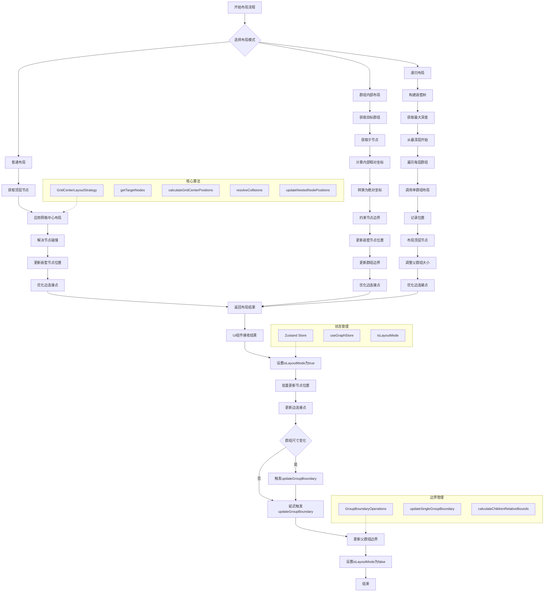

# 群组布局功能执行流程图

## 流程说明

### 1. 布局模式选择
- **普通布局**: 对整个画布进行网格布局
- **群组内部布局**: 仅对选中的群组内部节点进行布局
- **递归布局**: 从最深层群组开始，逐层向上对所有嵌套群组进行布局

### 2. 布局算法核心
- **GridCenterLayoutStrategy**: 主要的布局策略
- 包括目标节点获取、网格位置计算、碰撞解决等步骤

### 3. 群组边界管理
- **updateGroupBoundary**: 更新群组边界以包含所有子节点
- **防抖处理**: 避免频繁更新导致性能问题
- **递归更新**: 自动更新父群组边界

### 4. 状态管理
- **isLayoutMode**: 在布局过程中临时禁用约束逻辑
- **节点位置更新**: 批量更新以提高性能
- **历史记录**: 记录布局操作以便撤销/重做